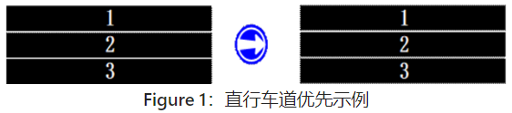
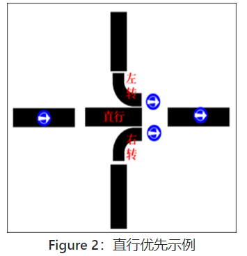
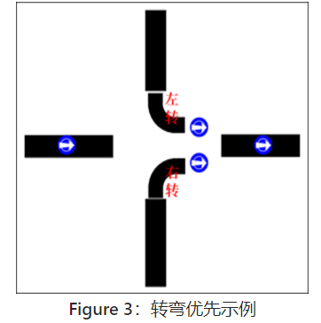
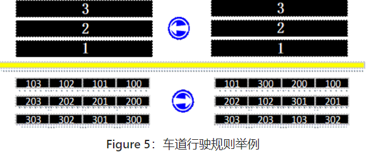
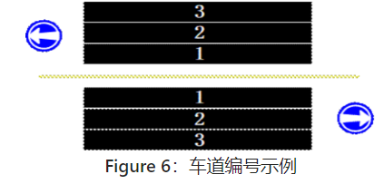
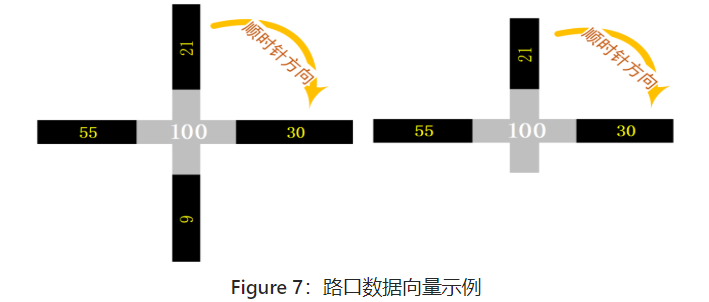

### 1.背景信息
道路交通是城市的核心要素之一。
随着社会经济的发展，中国城市的车辆保有量已经越来越多，大都市慢慢变成了“堵”市。如何在出行时避免拥堵，是每一个人的目标。
日常生活中，很多拥堵是由于车辆行驶路线规划失误，大批车辆集中选择主干道行驶导致通行效率下降。
如果车辆都由调度中心统一规划调度路线，拥堵问题将得到大大缓解甚至彻底解决。
实际上这一技术已经在工业领域如矿山车辆、无人货仓等得到广泛应用。
但道路上的私家车辆尚无法进行统一规划，未来，自动驾驶和物联网技术的结合，使得彻底解决这一难题出现了曙光。
请同学们提前出任“首席城市交通规划官”，为未来城市规划好每一辆车的行驶路线。
###2. 题目定义
在模拟的道路图上为每一辆车规划行驶路线，系统会自动根据规划路线运行。
在路线合法的前提下，最终所有车辆按照规划的路线到达目的地。
###3. 系统假定
路口完全立交：假定在每一个路口交汇的所有道路都可以完全互连，且车辆通过路口时不考虑在路口的通行时间。
无限神奇车库：我们认为，系统中的每个地点都有一个无限容量的“神奇车库”。车辆在未到既定出发时间前，或者到达目的后，就停放在“神奇车库”中，完全不影响其他车辆通过。但车辆一旦出发，在行驶过程中则不允许进入车库空间。
###4. 约束条件
不允许超车变道：即车辆一旦进入某条车道，就必须在此车道内从道路起点驶向道路终点，中途不允许变道，即使前车速度缓慢，也不允许超车。
排队先到先行：在一条道路前排队等待的所有车辆，按照到达时间先后进入道路。若多辆车在同一时间到达，按如下规则进入下一道路：
1. 同一道路牌车道号小（车道的编号）的车辆优先于车道号大的车辆

2. 按现实交通规则，直行车辆有优先通行权，直行车辆优先于转弯车辆

3. 处于左转进入道路的车辆优先于右转进入道路的车辆

- 车道固定进入：车辆在进入一段道路时按照车道编号从小到大的优先级选择可以进入的车道驶入，与前车的行驶速度无关。
- 即就是：车辆优先按车道编号由小到大依次进入，除非车道号小的车道没有空位可进入。

如下Figure 5：车道行驶规则举例所示，左侧道路车辆经一定时间行驶达到右侧道路车辆状态。

###5. 题目输入
每一个测试用例都分为三部分：
####道路
道路数据文件“road.txt”文件。
每一行数据为一条道路。
每条道路数据表示为：(道路id，道路长度，最高限速，车道数目，起始点id，终点id，是否双向)格式的向量。例如(502, 10, 6, 5, 2, 3, 1)的向量表示编号为502的道路，连接路口2和路口3的长度为10，限速6的双向5车道路段; (502, 10, 6, 5, 2, 3, 0)的向量表示编号为502的道路，连接路口2和路口3的长度为10，限速6的单向5车道路段。
起始点id：路口id（下文中有描述）
终止点id：路口id（下文中有描述）
是否双向：1：双向；0：单向
不管是双向道路还是单向道路，一条道路数据只会有一行数据表示，不会因为双向而多出来一行道路的数据表示。
“#”开始的数据行为说明性文字，可以理解成为注释。如“#(id,length,speed,channel,form,to,isDuplex)”。
对于多车道的道路，相对于行驶方向，车道编号从左至右依次增大。

####车辆
车辆数据文件“car.txt”。
每一行数据为一车辆。
每辆车数据表示为：(车辆id，始发地、目的地、最高速度、出发时间)格式的向量。例如(1001,1,16,6,1)的向量表示一辆编号是1001最高速度为6的车辆要在时间点1从路口1到达路口16。
始发地：路口id（下文中有描述）
目的地：路口id（下文中有描述）
“#”开始的数据行为说明性文字，可以理解成为注释。如“#(id,始发地,目的地,最高速度,出发时间)”。
####路口
路口数据文件“cross.txt”。
每一行数据为一个路口。
每个路口数据表示为：(路口id,道路id,道路id,道路id,道路id)格式的向量。例如(6, 504, 514, 505, 518)表示504，514，505，518这四条路段交汇的编号为6的路口。
路口信息数据向量中的道路id，以路口为中心，其所连接的道路id按顺时针方向编排。比如向量(100,21,30,9,55)和(100,21,30,-1,55)分别表示如下：

“#”开始的数据行为说明性文字，可以理解成为注释。如：“#(结点id,道路id,道路id,道路id,道路id)”。